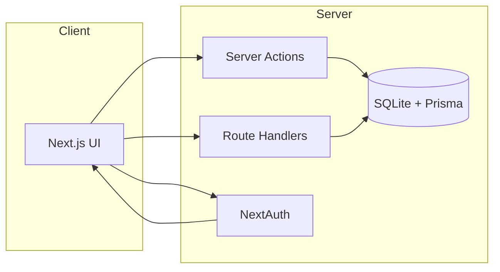

# 基本設計

## システム概要
ReportingService は、集計した数値データをレポートとして保存・可視化し、意思決定を支援する Web アプリケーション。

## 目的
- 重要な指標を整理し、誰でも最新の集計結果を参照できるようにする
- レポート作成と共有の手間を削減する

## スコープ
- レポートの一覧・詳細・作成・更新・削除
- チャートによる可視化
- デモ認証によるアクセス制御

## 用語定義
- レポート: タイトル・説明・チャート種別・数値系列を持つデータ
- 数値系列: `{ label, value }` の配列
- ダッシュボード: レポート一覧画面

## 機能一覧
- レポート一覧表示（ページネーション）
- レポート作成
- レポート詳細表示
- レポート編集
- レポート削除
- レポート API（CRUD）
- 認証（デモ）

## 非機能要件整理
- Vercel で動作すること
- 型安全とバリデーションを徹底
- Server Components を中心にパフォーマンス最適化
- レスポンシブ UI とエラーハンドリング

## 全体構成図

## 技術選定理由
- Next.js App Router: SSR/SSG/Server Actions の統合
- Prisma: 型安全でシンプルな DB 操作
- NextAuth: Next.js との高い親和性
- Tailwind CSS: 迅速で一貫した UI 構築
- Recharts: 軽量で柔軟なチャート描画

## コンポーネント構成
- `app/` ページと API
- `components/` UI コンポーネントとチャート
- `lib/` 認証・Prisma・バリデーション
- `prisma/` スキーマとシード
- `tests/` 単体テスト

## 外部依存
- Next.js
- NextAuth.js
- Prisma
- Recharts
- Tailwind CSS

## 制約事項
- DB は SQLite 前提（Vercel で運用する場合は外部 DB 推奨）
- 認証はデモ用の簡易実装
